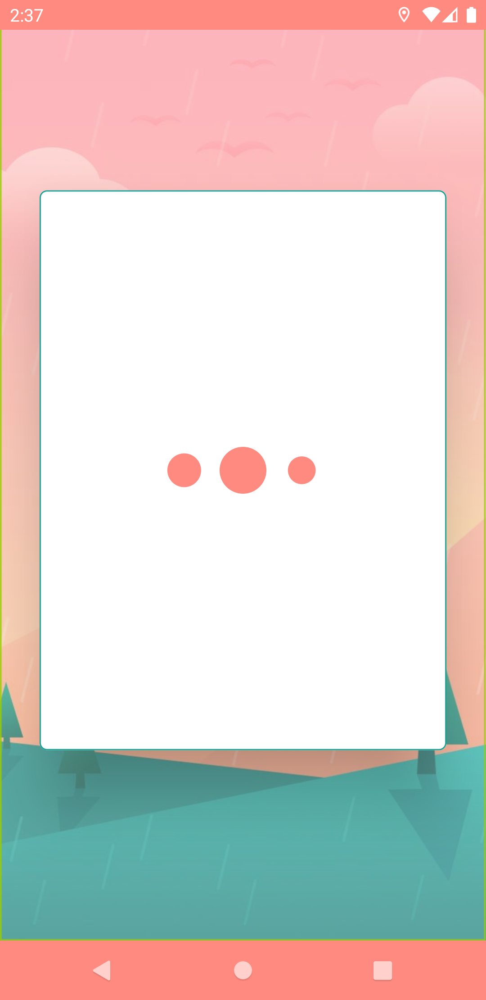
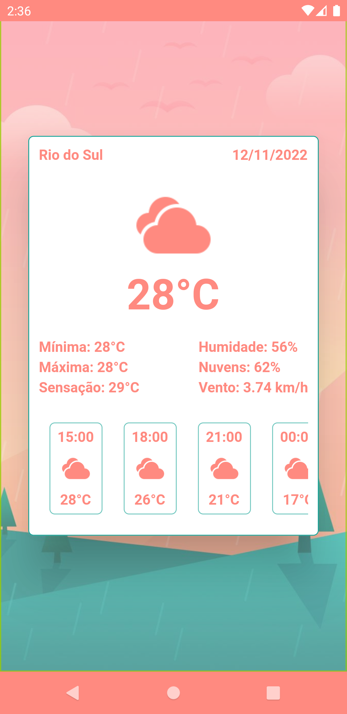

# Trabalho Final Flutter (Mobile)

Trabalho Final Flutter (Mobile) - Disciplina PROGRAMAÇÃO DISPOSITIVOS MÓVEIS (2022.2)

Aplicativo de previsão climática, feito usando os serviços de geolocalização, integração com a API Open Weather Map e clean-architecture.

  
  

----------
By [Victor B. Fiamoncini](https://github.com/Victor-Fiamoncini) ☕️
